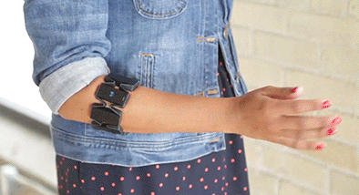
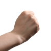
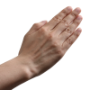
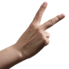

# Myo Dataset

Myo dataset made for the reaseach presented in my paper about ["Person-Independent sEMG Gesture Recognition Using LSTM Networks for Human-Computer Interaction"](https://wiki.tum.de/display/infar/%5B19WS+-+GR%5D+Person-Independent+sEMG+Gesture+Recognition+Using+LSTM+Networks+for+Human-Computer+Interaction).

This repository contains sEMG Data of 13 subjects recorded with the Myo Armband. Subjects were instructed to wear the armband on their dominant arm, like this:


The gestures that were recorded, are the ones from the Rock, Paper, Scissors game:





## File Naming Convention

Each recording was given it's own folder.
The folder are named like this: `<subjectId>_<arm>_<index>` (also called the label)
Where arm `r` stands for the right arm.

## Recorded Data

Each kind of data is stored in it's own file per recording.
| File Ending | Description |
| - | - |
|`<label>-<gestureType>-<index>-emg.csv`|Raw EMG Data from the Myo armband of the eight sensors|
|`<label>-<gestureType>-<index>-pose.csv`|Pose data (detected poses by the built-in Myo detecion)|`s6_r_1-paper-4-pose.csv`|
|`<label>-<gestureType>-<index>-orientation.csv`|IMU Orientation data|
|`<label>-<gestureType>-<index>-meta.csv`|Meta Data (see below)|

## Meta Data

Along with the raw EMG data that

Example along with explainatory comments:
```yaml
label: s6_r_1 # same as the folder
gesture: scissors # which gesture the user was told to record
index: 8 # 8th gesture of type scissors from this session

date: 21/08/2020
time: 05:49:30

arm: 0 # arm 0 = right, arm 1 = left
arm_direction: 1 # -1 if the armband was worn in reverse
rssi: -53 # signal strength
battery_level: 97 # 100 means full battery
mirror_left_arm: True # wether the recording applicatin automatically mirror the data if the user was left handed

files: # which data was recorded; e.g. pose data might miss, if no pose was detected
  - s6_r_1-scissors-8-pose.csv
  - s6_r_1-scissors-8-orientation.csv
  - s6_r_1-scissors-8-emg.csv

```

## Data Recording Procedure

In order to generate labeled data, a Python application
interfacing with the Myo was implemented. The data is recorded while
showing an icon and text label describing the gesture. Each gesture is
recorded for two seconds following a $0.5$ second break where subjects
are supposed to relax their arm. The two-second time-span was chosen
because several tests showed that it is the amount of time required for
most persons to perform the transition from rest pose to the wanted
gesture and back. In one recording iteration, each gesture is recorded
ten times, which makes a total of 30 gestures per iteration. Therefore,
one iteration takes 75 seconds. Those values were chosen after initial
testing, which showed that subjects quickly get exhausted performing the
gestures. After a short break, without taking the armband off, a second
iteration was performed in the same session. This is then repeated once
more. Some participants were recorded a second time: After a long break,
the armband was put on differently, and the process described above was
repeated. In total, each participant contributed three (one session) or
six iterations (two sessions). One additional participant recorded 30
datasets in 10 sessions on different days to create a highly specialized
dataset.

Thirteen healthy subjects aged between 18 and 58 years participated in
the data acquisition process. Four of them were female, and nine
candidates male. One participant was left-handed. All subjects agreed to
the data recording and analysis by writing. Before starting the
recording session, participants filled out the consent form, which
states what is being recorded and how the data is used. The Myo armband
was then put onto the thickest part of the forearm, just below the
elbow on the dominant arm. Then the subject waited until the
connection icon on the armband stopped blinking, which indicated that
the armband warmed up. After performing the Myo sync gesture, which is
needed to detect the arm wearing the armband, the Myo is ready to use.
Subjects were told to start from a rest pose, performing the gesture and
reaching the highest intensity when the progress bar indicates that half
the time passed.

There are multiple reasons for always using the dominant arm during the
recording. First, a possible user interface using one Myo armband would
be controlled with the dominant arm because it feels more natural to the
user. But also not using the dominant arm could introduce irregularities
into the dataset because users are not used to performing similar
gestures with their non-dominant arm. Also, differences in the data
resulting from recording the left and right arm are non-existent since
the current arm is detected, and the data mirrored accordingly.

All data provided by the Myo armband is stored in multiple files labeled
with a unique but randomized identifier. Each file contains roughly
400 ± 5 entries since the recording took two seconds, and the data was
sampled with. Each entry contains an index, a timestamp, and one value
for each of the eight sensors. and other data along with
meta-information (label, recording time, left or right arm, battery
level, and connection quality) is stored in other files.
